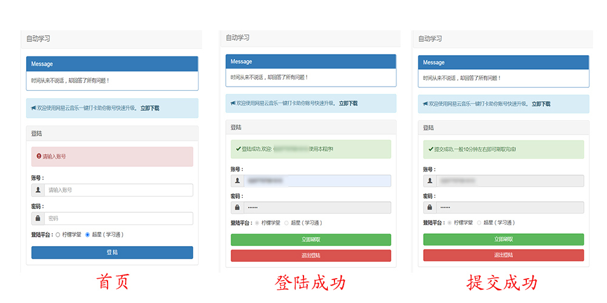

# 自动学习

## 工作原理

- 跨站请求伪造 (CSRF), 伪造请求头 , 调用官方 API

## 项目介绍

- 这是一个能够快速完成你的大专课程的项目，目前实现了两个课程平台（超星学习通和柠檬学堂）
- 柠檬学堂目前暂时只支持广州城建学校，当初写的时候只考虑到自己的能用就行了。
- 项目API接口文档：https://docs.apipost.cn/preview/0e16a078ec779fbb/d742afe1e625f5ec

## 注意项

- 本项目不提供线上 demo，请不要轻易信任使用他人提供的公开服务，以免发生安全问题,泄露自己的账号和密码

- 本项目仅供学习使用,请尊重版权，请勿利用此项目从事商业行为或进行破坏版权行为

## 运行

- 拉取本项目，使用 `npm install` 下载依赖包。
- 使用 `node` 命令启动根目录下的 `servr.js` 文件。
- 浏览器访问 `http://127.0.0.1:3001`  默认端口为 `3001`

[gif预览](http://www.wgudu.com/wp-content/uploads/Rec-0002.gif)

- 图片展示：

